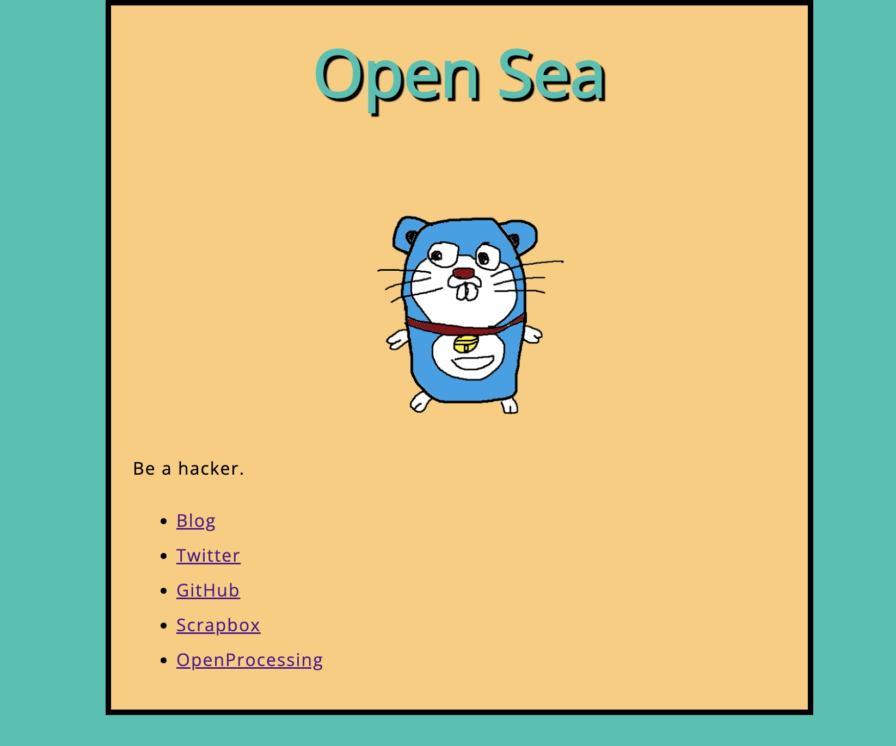

[ウェブ入門 - ウェブ開発を学ぶ | MDN](https://developer.mozilla.org/ja/docs/Learn/Getting_started_with_the_web) を読んで印象に残ったことなどの記録を残す記事です。

## 僕の開発環境

今回の学習を進めるにあたって以下の開発環境を使いました。

- Editor
    - [Visual Studio Code](https://code.visualstudio.com/)
- vscode 拡張機能
    - [Live Server](https://marketplace.visualstudio.com/items?itemName=ritwickdey.LiveServer)
        - `index.html`をこれを使って開いておけばプレビューがかなり楽でした

ウェブ入門をチュートリアル的に読み進めるには十分な環境です！

以降はトピック「Web サイトをどんな外見にするか」から見ていきます。

## Web サイトをどんな外見にするか

### まず最初: 計画を立てる

最初に以下の質問に解答しながら自分の作るWebサイトについて計画を立てます

> 1. 何について書かれた Web サイトですか？ 犬、ニューヨーク、それともパックマン？
> 1. テーマについてどんなことを書きますか？ タイトルと少しの文章、それからページに表示させたい画像を考えます。
> 1. Web サイトをどんな見た目にしますか？ シンプルで高いレベルから考えます。背景の色は何色にする？サイトにピッタリのフォントの種類はどんなもの？フォーマルなフォント？漫画みたいなフォント？くっきりとした太字？それとも、繊細な細字のフォントでしょうか？
>
> mdn web docs より引用

### デザインを大まかに描き出す

- 自分のサイトのデザインを大まかに紙やホワイトボードに描き出す
    - 大きなWebページを作るときにも役立つので習慣つけておく
        - プログラムのデザインを考えるときにも言えるかも

### アセットを選ぶ

- 文章、テキスト
- テーマカラー
    - [Trending Color Palettes - Coolors](https://coolors.co/palettes/trending)
        - 個人的におすすめのサイトです、色んな配色パターンを見つけることができます
    - [色選択ツール - CSS: カスケーディングスタイルシート | MDN](https://developer.mozilla.org/ja/docs/Web/CSS/CSS_Colors/Color_picker_tool)

- 画像
- フォント
    - [Browse Fonts - Google Fonts](https://fonts.google.com/)

## ファイルの扱い

Webサイトのファイル構造などについて

### ファウイル名について

以下を避ける
- 空白
- 大文字

**ハイフン or アンダースコア**
- ファイル名などはハイフンを使うべき
    - Google の検索エンジンはハイフンを単語の区切りとして扱うが、アンダースコアはそうしないから

### Webサイトのファイル構造

以下のようなサイト構造がMDNでは勧められていました。

- `index.html`
    - ユーザーがサイトに訪れたときに最初に見る内容がこのファイルです
- `images`
    - サイトで使用する全ての画像を入れます
- `styles`
    - コンテンツのスタイルを決定するCSSコードを入れます
- `scripts`
    - サイトにインタラクティブ機能を追加するために使用されるすべての JavaScript コードを入れます

```shell
your-site
├── images
│   ├── firefox-icon.png
│   └── zztkm-icon.png
├── index.html
├── scripts
│   └── main.js
└── styles
    └── style.css
```

## ウェブのしくみ

コンポーネントファイルが解析される順番

> - まず HTML ファイルが解析され、そのファイルの中を見ることで、どの CSS ファイルや JavaScript ファイルが参照されているかをサーバーが認識します。
> - HTML が解析され、 DOM ツリー構造が生成された後、リンクされた CSS が解析され、 DOM ツリーの適切な部分にスタイルが適用されます。この時点で、ページの視覚的な表現が画面に描かれ、ユーザーはページを見ることになります。
> - JavaScript は通常、 HTML と CSS の後に解析され、ページに適用されます。
>
> [ウェブのしくみ - ウェブ開発を学ぶ | MDN](https://developer.mozilla.org/ja/docs/Learn/Getting_started_with_the_web/How_the_Web_works#order_in_which_component_files_are_parsed)より

## まとめ

とりあえずチュートリアル的に読み進めてみて以下のようなアウトプットが出来上がりました。
次はHTMLに入門しようかなと思います！



https://tsurutatakumi.info/